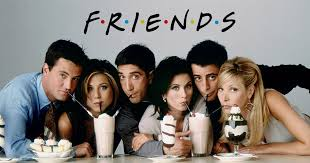
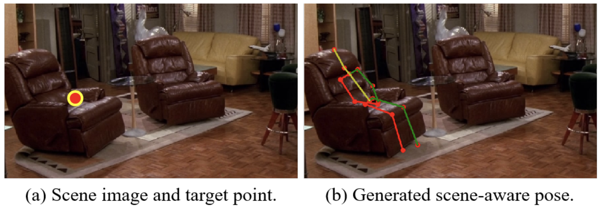
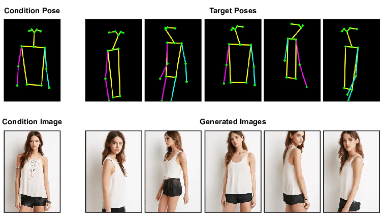
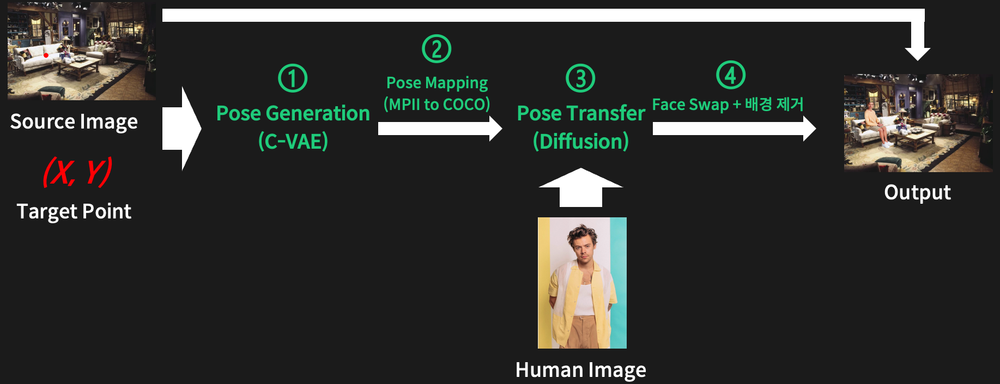
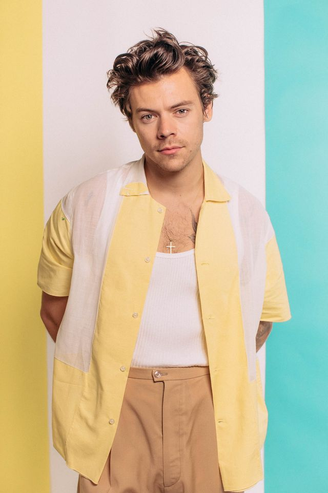
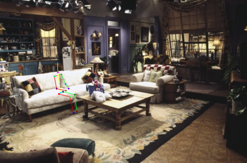
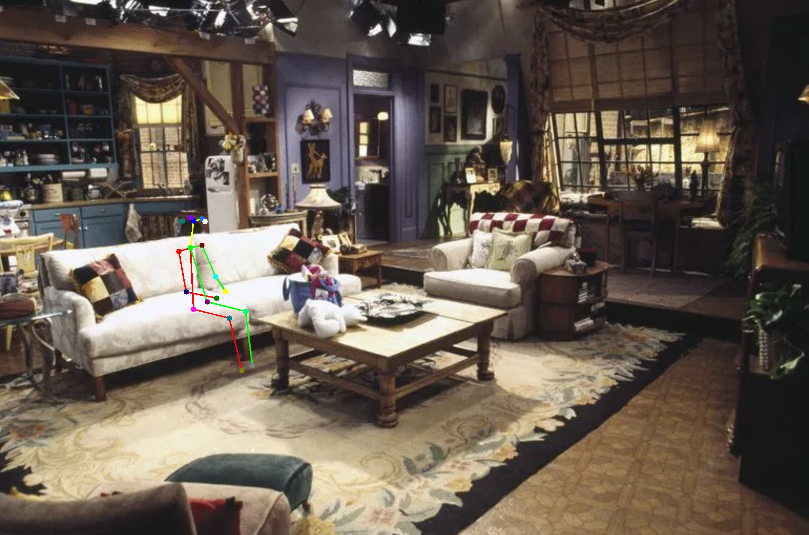
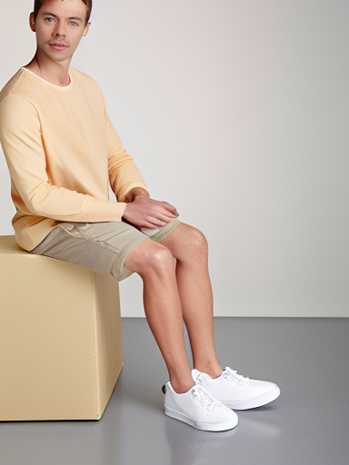
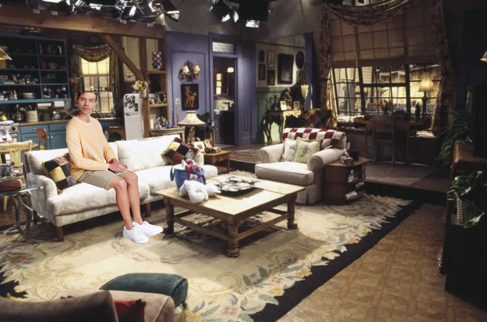

# 프렌즈에 엑스트라로 출연하기

📢 2024년 1학기 [AIKU](https://github.com/AIKU-Official) 활동으로 진행한 프로젝트입니다

## 소개

### 내가 프렌즈에 출연한다면?


위와 같은 상상 한 번쯤 해보신 적 있을 겁니다. 

실제로 출연하기는 힘드니, 이미지라도 합성해서 대리만족해봅시다.

출연하고 싶은 미디어의 이미지와 내 사진을 넣으면, 나를 이미지에 합성해주는 **프렌즈에 엑스트라로 출연하기** 프로젝트입니다.

## 방법론

### 문제 정의


사람 이미지를 합성할 때 단순 복사, 붙여넣기 하는 것보다는 사람이 이미지에 어울리는 포즈를 취하고 있는 것이 자연스러울 것입니다.

따라서 객체 간의 관계를 학습하는 **Affordance Learning**을 통해 주변 객체와의 관계를 고려한 포즈 키포인트를 생성하고, 해당 포즈를 취하고 있는 사람 이미지를 **Pose Transfer**를 통해 생성하여 원본 이미지에 합성합니다. 

이러한 방식을 통해 semantic하게 자연스러운 이미지를 합성할 수 있습니다. 

### 파이프라인


1. 이미지와 이미지 상의 위치가 주어지면, 해당 위치에 scene-aware한 pose keypoints 생성
2. MPII 형식의 pose keypoints를 COCO 형식의 pose keypoints로 매핑
3. 사람 이미지를 생성된 pose keypoints에 Pose Transfer하여 해당 포즈를 취하고 있는 사람 이미지 생성
4. 원본 사람 이미지와 생성된 사람 이미지의 얼굴을 Swap + 생성된 이미지의 배경 제거
5. 원본 이미지와 생성된 사람 이미지를 합성

## 환경 설정

아래에 나와있는 모델 Github들의 환경을 따릅니다. SAM의 경우, ```pip isntall segment-anything```으로 패키지 형태로 사용합니다.

## 사용 방법

### Off-the-shelf Model

**Pose Transfer: CFLD (Coarse-to-Fine Latent Diffusion) [[github](https://github.com/YanzuoLu/CFLD)][[paper](https://arxiv.org/abs/2402.18078)]**

**Face Swap: sber-swap [[github](https://github.com/cedro3/sber-swap)][[paper](https://arxiv.org/abs/2202.03046)]**

**배경 제거: SAM (Segment Anything Model) [[github](https://github.com/facebookresearch/segment-anything)][[paper](https://arxiv.org/abs/2304.02643)]**

### 실행 과정

코드와 pretrained weight는 각각의 모델 github를 따릅니다.

1. CFLD github clone + pretrained weight 다운, 이후 CFLD 폴더에 clfd_app.py 옮기기
2. sber-swap github clone + pretrained weight 다운, 이후 sber-swap 폴더에 swap_app.py 옮기기
3. main_pipeline.ipynb에서 파이프라인 실행

추후 보완할 예정입니다.

## 예시 결과

### Input (원본 이미지 + 위치(빨간 점) + 합성하려는 사람 이미지)


***

### Pose Generation & Pose Mapping (MPII to COCO)


***

### Pose Transfer & Face Swap


***

### Output


***

## 팀원

- [문승기](https://github.com/moon44432): 포즈 키포인트 매핑, VAE 모델 구현
- [이정은](https://github.com/es2ilver): Face swap(sber-swap), 전체 파이프라인 구성
- [이창엽](https://github.com/PROLCY): 팀장, Pose Generation 학습, Pose Transfer(CFLD)
- [정성연](https://github.com/ChungSungyeon): 배경 제거(Segment Anything Model), VAE Dataoloader 구현